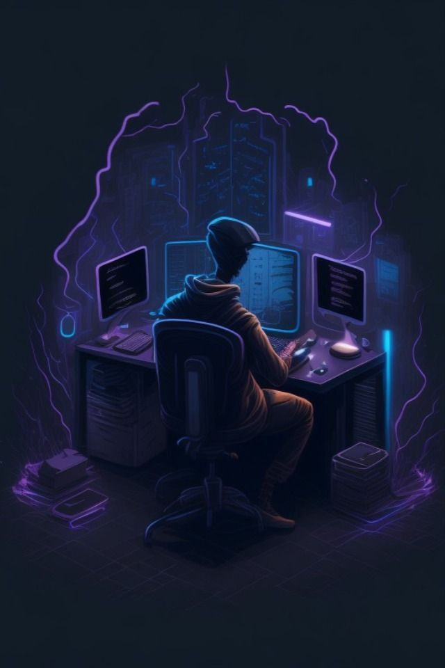

<h1 align="center" style="color:#8a2be2;">Hi 👋, I'm Lokesh Wagh</h1>
<h3 align="center" style="color:#9370db;">🚀 Innovative Software Engineer | Full-Stack Developer | Problem-Solver 
💡 Expertise in Web Development, Java, DSA, Algorithms & SQL</h3>

  

  

---

<h1> About Me 💬</h1>

- 👨‍💻 Final-year Computer Science and Engineering student with a strong passion for software development and problem-solving.

- 🎓 Currently mastering:

       - 🚀 Data Structures & Algorithms (Java) to build optimized and scalable solutions.

       - 💻 Full-Stack Web Development with JavaScript, React.js, Node.js, and Spring Boot to craft dynamic and high-performance applications.
---

 👨‍💻 Languages

  
  
  
  
  
  

 🛠️ Tools

  
  
  
  
  
  
  
  

---

# 🌐 Portfolio & Connect with Me
- 💻 **Portfolio**: (https://lokeshwaghportfolio.netlify.app/)
- 📧 **Email**: [lokeshwagh675@gmail.com](mailto:lokeshwagh675@gmail.com)
- 📄 **Resume**: [View My Experiences](https://drive.google.com/file/d/1q5YXUmDPJANcXDzvi-5oUM5xOf1kaLx1/view?usp=sharing)

  
  
  
  
  

---

---

*Thank you for visiting my profile! Feel free to explore and connect with me!*
